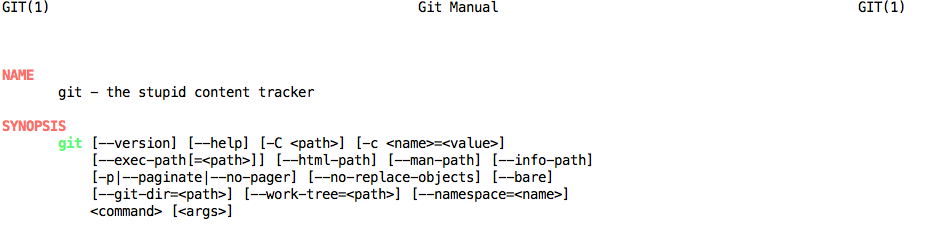

#So, Do You Git It?

**Asif Imran** Jan 27, 2015

##Basics of version control
- Save numbered files (*Horrible Idea*)

- Email to self (*Again just bad... don't do it*)
- Use available tools (CVS, SVN, Parforce, Bazaar, Git, ...)
 - Keep track of changes-- timeline/history is important for transparency
 - Jump easily between version
 - Robust/Makes it **harder** to lose work
 - Scales(!) with multiple people. Easily merge work

##Why Git

- /**git**/  
*noun* British *informal*: an unpleasant or contemptuous person

- Git in its own words
>
- *Open source* distributed version control created by Linus Torvalds.
 - full copies of the repository on every contributor
 - Git tracks files and metadata
- Git ≠ Github
  - Github is a collaboration platform built on Git
- Git is **not** a backup solution. You will still need a safe place/mechanism to backup your work
- Fast.
- Very popular
- You can use it for anything that is stored in text format
  - Recipes
  - Presentations
  - Journals
